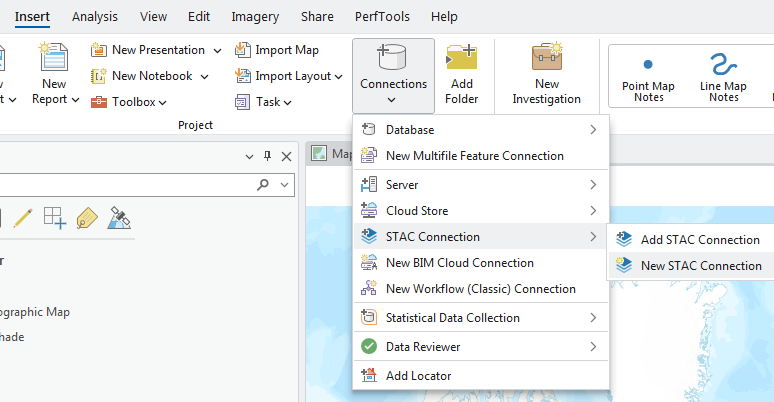
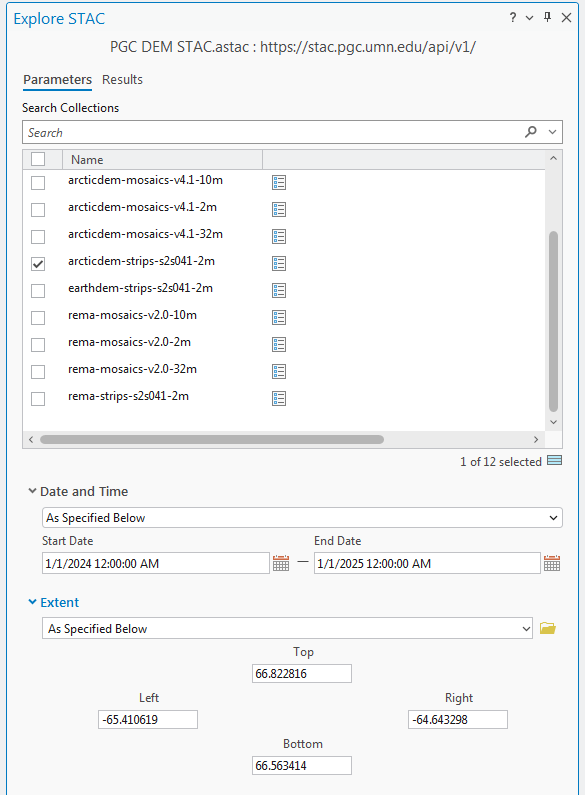

# Accessing PGC STAC API in Desktop GIS Software
PGC publishes its Digital Elevation Models (DEMs) as an interactive STAC API. These instructions share how to access these datasets from within common desktop GIS platforms.

The STAC API url is: `https://stac.pgc.umn.edu/api/v1/`

## ArcGIS Pro
ESRI provides [instructions for using STAC endpoints within ArcGIS Pro](https://pro.arcgis.com/en/pro-app/latest/help/data/imagery/introduction-to-stac.htm), which we recommend following for initial setup. We will be demonstrating how to create a connection to the PGC STAC, query the API, and add data to your project. One note: this functionality requires ArcGIS Pro version 3.2 or higher. Since this is a new feature in ArcGIS Pro, there may be unexpected errors or limited functionality compared to other tools. 

1. In the ribbon menu, click Insert, then Connections, then STAC Connections. Select New STAC Connection.

    

2. The Create STAC Connection panel opens. Name the Connection something like PGC DEM STAC, and in the Connection field use the URL: https://stac.pgc.umn.edu/api/v1/

    

3. In the Catalog Pane, click the triangle beside STACs. Your new STAC API connection should be listed. Right-click the connection and click Explore STAC.

    

4.  In the Explore STAC pane, you can select and query the available collections by a variety of parameters. NOTE: the DEM Mosaics will not have a valid Date for querying because they are built from Strip DEMs with different acquisition times. 

    

5. Click View Results to see the results of your search, and from the Results you can view the footprint in the map to preview the spatial extent of the item and then click the `Add Data` icon to add items onto the map. Currently, preview images do not load in the ArcPro STAC viewer.

    

6. Once added to your map document, you might have to update the symbology to render the DEMs as expected, such as using the `Shaded relief` symbology option or applying a Min/Max or Clip stretch to the DEM symbology layer. 

    

## QGIS
The developers of the STAC Spec provide detailed tutorials for [installing the QGIS STAC API Browser Plugin](https://stacspec.org/en/tutorials/1-install-stac-api-browser-qgis-plugin/) and [using the plugin](https://stacspec.org/en/tutorials/2-intro-to-stac-api-browser-qgis-plugin/). We will give a brief overview here for loading data from the PGC STAC with the plugin.

1. Install the STAC API Browser in QGIS: from the Plugins menu, click on "Manage and Install Plugins.." 

    

2. Search for and select the STAC API Browser, then click `Install Plugin`. 

    

3. Launch the plugin by selecting it from the Plugins menu or click on the STAC Browser icon in the toolbar.

    

4. When the browser opens, click New under the Connections field.

5. Name the connection something like PGC STAC, and in the URL field use: https://stac.pgc.umn.edu/api/v1/ . Leave the other fields as they are. If you wish, you can click Test connection to confirm the connection works.

    

6. Once you have added the PGC dem STAC connection, click on the `Fetch collections` button to browse the various collections within PGC’s STAC Catalog. Select on use the query options to filter by date or extent. Click Search to view results. 

    

7. On the Results page, click View assets to see all the files associated with an item. For Strip DEMs, each item will have 8 associated layers, including the 2m DEM, a 10m hillshade for visualization/preview, and a datamask to remove bad data from the DEM. Visit [our website](https://www.pgc.umn.edu/data/elevation/) for a full description of the layers and metadata.

    