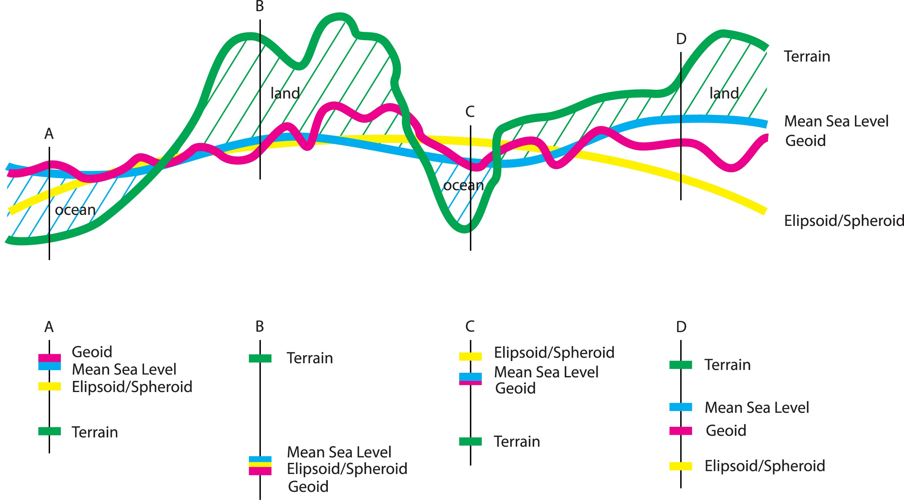
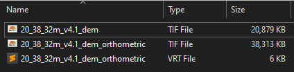
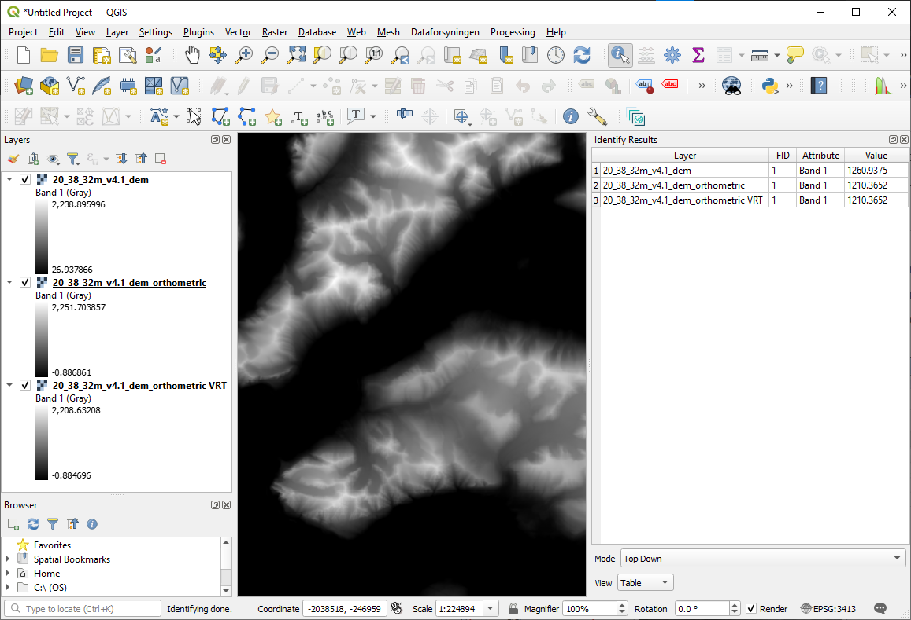

# Converting DEM values from ellipsoidal to orthometric (geoid) elevation

Are you wondering why the elevation value for your area of interest along an ocean coastline is -50 meters? This tutorial will talk about the difference between ellispoidal and geoidal vertical reference systems for Digital Elevation Models (DEMs) and how to convert PGC DEMs elevation values between them.

## What is an ellipsoid and a geoid?

While the Earth is spherical, its surface is not a perfect sphere and is in fact a rather complex, irregular surface influenced not just by landforms but also by gravity and rotation. There is a whole field of science dedicated to studying and measuring this: [geodesy](https://en.wikipedia.org/wiki/Geodesy). Thus, data users must be cautious about the reference surface model of their data sources and the desired output. Broadly, there are two types of reference surfaces for elevation measurements: ellipsoid and geoid. 
 - [Ellipsoid](https://en.wikipedia.org/wiki/Earth_ellipsoid): a simplified mathematical model of the earth's surface, a smooth but deformed sphere accounting for how the earth's rotation impacts how its mass is distributed. The [WGS84 datum](https://en.wikipedia.org/wiki/World_Geodetic_System) uses an ellipsoid surface.
 - [Geoid](https://en.wikipedia.org/wiki/Geoid): a complex surface based on gravity measurements that accounts for the irregular shape of the planet's surface, often published in reference to an ellipsoid. Due to the complexity of the surface, there are many smaller geoid models specific to local or national boundaries. Orthometric height values will use a geoid vertical reference and can be thought of as height above Mean Sea Level.

The [Intergovernmental Committee on Surveying and Mapping](https://www.icsm.gov.au/education/fundamentals-mapping/datums) in Australia put together a handy illustration denoting the differences in these ways of measuring the Earth's surface and how they can vary depending on location and terrain features. When performing a vertical reference transformation, we use gridded rasters that measure the difference between the ellipsoid and the geoid and add/subtract from the reference DEM surface to represent terrain elevation relative to the geoid. 



## Converting PGC DEMs to a different vertical reference system

PGC publishes its [DEM data products](https://www.pgc.umn.edu/data/elevation/)--ArcticDEM, the Reference Elevation Model of Antarctica (REMA), and EarthDEM--with a vertical reference of height above the WGS84 ellipsoid. Since these values can differ greatly from geoidal (orthometric) and Mean Sea Level heights, we will demonstrate how to convert the elevation values using GDAL command line tools and note some potential pitfalls to ensure you get the outputs you expect. 

For the vertical reference conversion, we will use methods common for geospatial coordinate transformations using EPSG codes and append a vertical datum code when defining the target spatial reference system. While many countries have more accurate local geoid models, for the polar regions the best option is the [EGM08 geoid](https://epsg.io/3855) `EPSG:3855`. The syntax to use with PGC's polar DEM products appends this vertical code to the EPSG code of the coordinate system for the GDAL command demonstrated below: 
 - REMA (Antarctica): `EPSG:3031+3855`
 - ArcticDEM: `EPSG:3413+3855`

### Sample conversion scripts
#### Basic `gdalwarp` Command
The basic command we will use is `gdalwarp` ([documentation](https://gdal.org/en/stable/programs/gdalwarp.html)), demonstrating a few options for PGC DEM inputs--local GeoTIFF file and AWS-hosted Cloud Optimized GeoTIFF (COG) on the cloud--and outputs--local GeoTIFF and VRT (Virtual Raster). Follow [instructions here](https://gdal.org/en/stable/download.html) to download and install GDAL. We recommend using Conda/Mamba to manage environments and installing with `conda install -c conda-forge gdal`. 

The basic command structure is:

```gdalwarp -optional_arguments -t_srs sourcefile destinationfile``` 

 - Source File: input DEM
 - Destination File: output DEM with geoid transformation applied 
 - Target Spatial Reference `-t_srs`: The optional argument you will need to do the vertical reference conversion is the `-t_srs` (target spatial reference system) using the `EPSG:XYproj+Zproj`. PGC DEMs are natively in polar projections, `EPSG:3031` for REMA and `EPSG:3413` for ArcticDEM. Adding the EPSG code for the EGM08 vertical reference `+3855` will convert ellipsoidal elevation values to height above geoid values. There is also an option to specify the source SRS `-s_srs`, but GDAL will read that data from the input file by default, so it is not necessary when using PGC DEMs. 

Optional Arguments
 - Target Output File Type `-of`: You can also specify the output file type with the `-of`. GDAL will guess the output format from the file extension in the `dstfile` if none is specified. A useful output type is the Virtual Raster `.vrt`, which will not write the output to a new file, but will act as a pointer to the source file transforming the data on the fly when accessed. This is particularly handy to avoid essentially duplicating files when performing spatial transformations or merging raster files together.
 - Additional Creation Options `-co`: GDAL also provides additional creation options for each driver, including compression and tiling. Details can be found here for [GeoTIFF](https://gdal.org/en/stable/drivers/raster/gtiff.html#creation-options) and [COGs](https://gdal.org/en/stable/drivers/raster/cog.html#creation-options).   

#### Examples

For a local ArcticDEM mosaic tile, from .tif to .tif:

```gdalwarp -t_srs EPSG:3413+3855 \path\to\dems\20_37_10m_v4.1_dem.tif \path\to\outputs\20_37_10m_v4.1_dem_orthometric.tif```

For a web-hosted REMA Strip DEM, from COG to VRT. This approach leverages the AWS-hosted data:

```gdalwarp -of VRT -t_srs EPSG:3031+3855 /vsicurl/https://pgc-opendata-dems.s3.us-west-2.amazonaws.com/rema/strips/s2s041/2m/s77e166/SETSM_s2s041_WV01_20180915_1020010079996900_1020010078866100_2m_lsf_seg1_dem.tif rema_strip_orthometric.vrt```

Transforming the other way, from orthometric (geoid) to ellipsoid, you can set the `-s_srs` flag to specify that the source DEM has the geoidal vertical reference transformation applied and that the output should not: 

``` gdalwarp -s_srs EPSG:3031+3855 -t_srs EPSG:3031 rema_orthometric.tif rema_ellipsoidal.tif ```

### Verifying conversion outputs
Users can verify the outputs with GDAL tools or in a desktop GIS application. `gdalinfo` will return details about the spatial projection, including any vertical reference details. Here we see the `EGM2008 geoid` applied after the `gdalwarp` transformation:
```
gdalinfo dem_orthometric.tif

...
    VERTCRS["EGM2008 height",
        VDATUM["EGM2008 geoid"],
        CS[vertical,1],
            AXIS["gravity-related height (H)",up,
                LENGTHUNIT["metre",1]],
        USAGE[
            SCOPE["Geodesy."],
            AREA["World."],
            BBOX[-90,-180,90,180]],
        ID["EPSG",3855]]]
...
```

In QGIS, using an identify tool on the DEMs will return different elevation values for the original ellipsoid referenced DEM and the orthometric height DEM. Note that the .tif output and the equivalent .vrt output return the same values. However, the .vrt file includes downsampled overviews at larger zoom extents, which might return different values even though the underlying pixel values at full resolution are equivalent:





## Potential errors and how to check for them

When performing this vertical transformation with GDAL, the software needs to access the grid file to compute the elevation values. If the elevation values to not change after running the `gdalwarp` command, this might be the cause of the issue, since it does not always return an error indicating that it could not find the relevant grid file. Setting the `PROJ_NETWORK` environment variable should alleviate the problem. You can use the `gdallocationinfo` command to spot check a coordinate within the bounds of the input and output rasters to check if the transformation has been applied as expected. Here, we demonstrate how to check the value of a pixel from a COG on AWS and then check the value after applying the transformation to an output VRT.

``` 
# check ellipsoid elevation of DEM strip on aws
gdallocationinfo -geoloc /vsicurl/https://pgc-opendata-dems.s3.us-west-2.amazonaws.com/rema/strips/s2s041/2m/s77e166/SETSM_s2s041_WV01_20180915_1020010079996900_1020010078866100_2m_lsf_seg1_dem.tif 324249.000 -1380735.000
Report:
  Location: (6616P,7105L)
  Band 1:
    Value: -53.859375
    
# transform vertical reference to .vrt
gdalwarp -of VRT -t_srs EPSG:3031+3855 /vsicurl/https://pgc-opendata-dems.s3.us-west-2.amazonaws.com/rema/strips/s2s041/2m/s77e166/SETSM_s2s041_WV01_20180915_1020010079996900_1020010078866100_2m_lsf_seg1_dem.tif dem_orthometric.vrt

# check geoidal elevation of transformed DEM
gdallocationinfo -geoloc dem_orthometric.vrt 324249.000 -1380735.000
Report:
  Location: (6616P,7105L)
  Band 1:
    Value: 1.05549550056458

# If these values are the same, GDAL likely could not find the required geoid grid
# You can try setting the PROJ_NETWORK variable to enable GDAL to pull the necessary grid from online
PROJ_NETWORK=ON gdallocationinfo -geoloc dem_orthometric.vrt 324249.000 -1380735.000
Report:
  Location: (6616P,7105L)
  Band 1:
    Value: 1.05549550056458
```

## Additional Resources
- [Explanation of Datums](https://www.icsm.gov.au/education/fundamentals-mapping/datums) by the Intergovernmental Committee on Surveying and Mapping